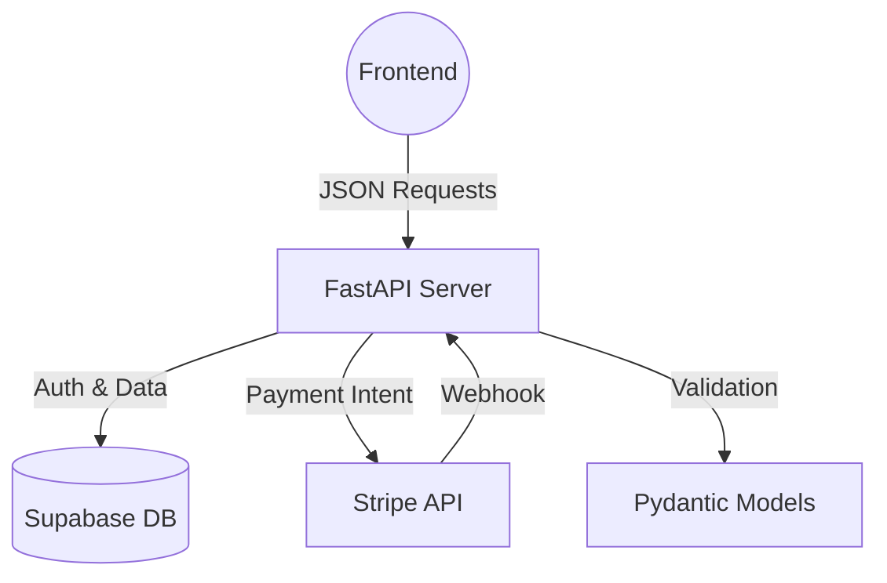

# 🚀 Eventora Backend API

The powerful backend API powering the **Eventora** Event Management System. Built with **FastAPI** for high performance, **Supabase** for database & authentication, and **Stripe** for secure payments.

---

## 🏗️ System Architecture

This diagram illustrates the data flow within the backend services.

🛠️ Tech Stack

    Framework: FastAPI (Python)

    Database: Supabase (PostgreSQL)

    Authentication: Supabase Auth (JWT Validation)

    Payments: Stripe API (Checkout Sessions & Webhooks)

    Deployment: Render (Web Service)

    Validation: Pydantic

    Server: Uvicorn

✨ Key Features

    🔐 User Management: Secure Authentication flow (Sign up, Login, OAuth integration).

    📅 Event Management: Complete CRUD operations for events, categories, and profiles.

    🎟️ Booking System: Real-time ticket availability checks and concurrency handling.

    💳 Stripe Integration: Secure checkout session generation and Webhook listening for payment confirmation.

    📈 Dashboard Analytics: Aggregated data endpoints for event organizers.

    🛡️ Security: CORS protection, JWT token verification, and input sanitization.

⚙️ Local Development Setup

Follow these steps to run the backend locally on your machine.
1. Clone the Repository
Bash

git clone [https://github.com/Goh0809/Eventora-Backend.git](https://github.com/Goh0809/Eventora-Backend.git)
cd Eventora-Backend

2. Create Virtual Environment
Bash

# Windows
python -m venv .venv
.venv\Scripts\activate

# Mac/Linux
python3 -m venv .venv
source .venv/bin/activate

3. Install Dependencies
Bash

pip install -r requirements.txt

4. Configure Environment Variables

Create a .env file in the root directory and add the following keys:
Code snippet

# APP SETTINGS
PROJECT_NAME="Eventora API"
API_V1_PREFIX="/api/v1"
# Allow requests from your local frontend
CORS_ORIGINS=["http://localhost:3000", "http://localhost:5173"]

# SUPABASE (Database & Auth)
SUPABASE_URL=your_supabase_url
SUPABASE_KEY=your_supabase_anon_key
SUPABASE_SERVICE_ROLE_KEY=your_service_role_key

# STRIPE (Payments)
STRIPE_SECRET_KEY=sk_test_...
STRIPE_PUBLISHABLE_KEY=pk_test_...
STRIPE_WEBHOOK_SECRET=whsec_...

# AUTH (JWT)
JWT_SECRET_KEY=your_jwt_secret
JWT_ALGORITHM=HS256
ACCESS_TOKEN_EXPIRE_MINUTES=10080

5. Run the Server
Bash

uvicorn app.main:app --reload

The API will be available at: http://localhost:8000

Interactive Docs (Swagger UI): http://localhost:8000/docs
🚀 Deployment (Render)

This project is optimized for deployment on Render.
Build Command
Bash

pip install -r requirements.txt

Start Command

Crucial: Must listen on port 10000
Bash

uvicorn app.main:app --host 0.0.0.0 --port 10000
